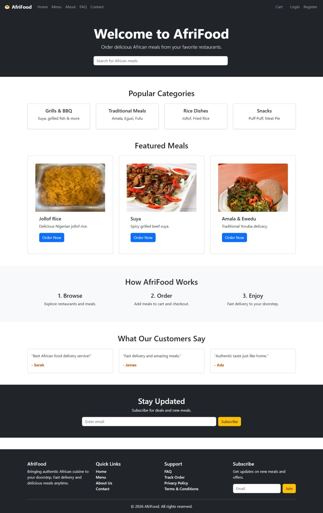

 # AfriFood 
AfriFood is a full-stack online food ordering platform built with React, Spring Boot, JWT Authentication, and Microsoft SQL Server. The application allows users to browse African dishes, add meals to cart, place orders, and securely manage sessions using JWT-based authentication. It also includes an admin dashboard for managing foods, orders, and users.

---

# Features

## Customer Features

- User Registration & Login
- JWT Authentication with HTTP-only Cookies
- Browse African Food Menu
- Add/Remove Items from Cart
- Checkout & Place Orders
- View User Orders
- Protected Routes
- Persistent Authentication Sessions

<p float="left">
  
  
</p>
---

## Admin Features

- Admin Dashboard
- Manage Food Items
- View Customer Orders
- Update Order Status
- Manage Users
- Role-Based Access Control (RBAC)

---

# Tech Stack

## Frontend

- React.js
- React Router DOM
- Context API
- Fetch API
- Vite

---

## Backend

- Spring Boot
- Spring Security
- Spring Data JPA
- JWT Authentication
- Hibernate ORM

---

## Database

- Microsoft SQL Server

---

# Project Structure

```text
AfriFood/
│
├── frontend/
│   ├── src/
│   │   ├── admin/
│   │   ├── components/
│   │   ├── context/
│   │   ├── pages/
│   │   ├── routes/
│   │   └── services/
│
├── backend/
│   ├── src/main/java/com/afrifoodApp/
│   │   ├── controller/
│   │   ├── entity/
│   │   ├── repository/
│   │   ├── services/
│   │   ├── security/
│   │   └── config/
│   │
│   └── resources/
│       └── application.properties
```

---

# Database Schema

## Tables

- users
- afri_foods
- cart
- cart_items
- orders
- order_items

---

# Entity Relationships

```text
User
 ├── Cart
 │     └── CartItems
 │             └── Food
 │
 └── Orders
        └── OrderItems
                └── Food
```

---

# Authentication Flow

## Login Process

1. User submits email and password
2. Spring Security authenticates credentials
3. JWT token is generated
4. Token stored in HTTP-only cookie
5. JWT Filter validates requests
6. User session persists automatically

---

# API Endpoints

## Authentication

| Method | Endpoint | Description |
|---|---|---|
| POST | /api/register | Register new user |
| POST | /api/login | Login user |
| GET | /api/auth/me | Get authenticated user |

---

## Food APIs

| Method | Endpoint | Description |
|---|---|---|
| GET | /api/foods | Get all foods |
| GET | /api/foods/{id} | Get food by ID |
| POST | /api/admin/foods | Create food |
| PUT | /api/admin/foods/{id} | Update food |
| DELETE | /api/admin/foods/{id} | Delete food |

---

## Cart APIs

| Method | Endpoint | Description |
|---|---|---|
| GET | /api/cart | Get user cart |
| POST | /api/cart/add | Add item to cart |
| DELETE | /api/cart/remove/{id} | Remove cart item |

---

## Order APIs

| Method | Endpoint | Description |
|---|---|---|
| POST | /api/orders | Place order |
| GET | /api/orders | Get user orders |
| GET | /api/admin/orders | Get all orders |

---

# Security Configuration

The application uses:

- Spring Security
- JWT Authentication
- HTTP-only cookies
- Role-based route protection
- CORS configuration

---

# Roles

## USER

Can:

- Browse foods
- Add to cart
- Checkout
- View own orders

---

## ADMIN

Can:

- Manage foods
- View all orders
- Manage users
- Access admin dashboard

---

# Installation & Setup

## Clone Repository

```bash
git clone https://github.com/michaelanwachuks/afrifood.git
```

---

# Backend Setup

## Navigate to backend

```bash
cd backend
```

---

## Configure application.properties

```properties
spring.datasource.url=jdbc:sqlserver://localhost:1433;databaseName=afrifood;encrypt=true;trustServerCertificate=true

spring.datasource.username=sa
spring.datasource.password=yourpassword

spring.jpa.hibernate.ddl-auto=update
spring.jpa.show-sql=true
```

---

## Run Backend

```bash
./mvnw spring-boot:run
```

Backend runs on:

```text
http://localhost:8080
```

---

# Frontend Setup

## Navigate to frontend

```bash
cd frontend
```

---

## Install dependencies

```bash
npm install
```

---

## Run Frontend

```bash
npm run dev
```

Frontend runs on:

```text
http://localhost:5173
```

---

# JWT Authentication Setup

JWT tokens are:

- Generated on login
- Stored in HTTP-only cookies
- Automatically validated using JwtFilter
- Used for protected endpoints

---

# Features in Progress

- Payment Integration
- Food Image Uploads
- Email Notifications
- Delivery Tracking
- Reviews & Ratings
- Coupon System
- Mobile App
- Docker Deployment
- CI/CD Pipeline

---

# Development Notes

- Hibernate automatically creates database tables from entity classes
- Relationships are managed using JPA annotations
- Context API manages frontend authentication state
- Protected routes are implemented using React Router

---

# Contributor(s)

Michael Nwangwu

---

# License

The project can be downloaded and reused
